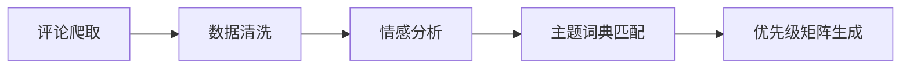

# 🏆 GCH_ALL_matchcode

<p align="center">
  <strong>📌 比赛已结束 | 代码仅供个人公开参考 | 非商业用途</strong>
</p>

<p align="center">
  <em>Competition Has Ended — This repository is for personal public reference only. Not for commercial use.</em>
</p>

---

## 📑 目录导航 / Guide

| 章节 | 内容 |
|:---|:---|
| [📖 项目简介](#-项目简介) | 仓库整体说明 |
| [📁 目录结构](#-目录结构) | 完整文件结构导览 |
| [🤖 25国创技术Demo](#-25国创技术demo) | AI智能眼镜多模态：手势识别 + 路面障碍检测 |
| [📊 25国创预稿代码](#-25国创预稿代码) | 社交媒体评论爬取与情感分析 |
| [🎓 26正大杯](#-26正大杯) | 正大杯数据分析竞赛作品 |
| [🏫 工作室实训](#-工作室实训) | 工作室实训项目 |
| [📈 模型对比可视化](#-模型对比可视化) | CVIT 模型性能对比分析 |
| [⚠️ 声明](#️-声明) | 比赛/版权/使用声明 |
| [🛠 环境依赖](#-环境依赖) | 通用环境配置说明 |

---

## 📖 项目简介

本仓库汇集了本人参加 **2025年大学生创新创业训练计划（国创）** 和 **2026年正大杯市场调查与分析大赛** 等相关竞赛的代码作品。内容涵盖：

- 🕶️ **AI智能眼镜多模态交互** — 基于 MediaPipe + YOLOv8 的手势识别与路面障碍检测
- 📝 **社交媒体评论分析** — B站/抖音/微博评论爬取、情感分析、主题挖掘
- 📊 **数据可视化与建模** — 模型性能对比、词云、优先级矩阵等

> **所有比赛均已结束，本仓库代码仅供学习交流与个人公开参考。**

---

## 📁 目录结构

```
gch_ALL_matchcode/
│
├── 25国创技术方面demo/          # 国创：AI智能眼镜技术Demo
│   ├── 基于mediapipe检测手势指令.py
│   ├── 基于mediapipe检测手势指令（眼镜摄像头）.py
│   ├── 基于yolov8检测路面障碍.py
│   ├── 基于yolov8检测路面障碍（眼镜摄像头）.py
│   ├── test2.py / test3.py
│   ├── yolov8n.pt / yolov8m.pt / yolov8m-pose.pt
│   ├── 技术文档.md
│   ├── 开车视角/                # 驾驶视角测试图像
│   └── 检测后视角/              # 检测结果截图
│
├── 25国创预稿代码/              # 国创：社交媒体评论分析
│   ├── 爬取1.py
│   ├── 爬取b站评论.py
│   ├── 爬取抖音评论.py
│   ├── 评论情感分析.py
│   ├── 评论情感得分分析.py
│   ├── Test1.py / test2.py
│   ├── theme_dictionaries/      # 主题词典
│   ├── 情感分析数据/            # 分析数据
│   ├── 图/                      # 生成的图表
│   ├── AI眼镜视频评论/          # 视频评论数据
│   └── chromedriver.exe
│
├── 26正大杯/                    # 正大杯：VR校园数据分析
│   ├── 爬取1.py
│   ├── 爬取b站评论.py
│   ├── 爬取微博评论.py
│   ├── 爬取抖音评论.py
│   ├── 爬取非爬虫类评论.py
│   ├── 屏幕定位.py
│   ├── 分析类/                  # 分析模块
│   │   ├── 情感得分/
│   │   ├── 词云图/
│   │   └── 需求主题/
│   └── vr校园视频评论/          # VR校园视频评论数据
│
├── 工作室实训/                  # 工作室实训项目
│   ├── data/
│   └── 实训1代码.py
│
├── test1.py                     # 模型参数量/准确率对比可视化
├── 1_参数量对比图.png
├── 2_计算量对比图.png
├── 3_识别时间对比图.png
├── 4_准确率对比图.png
└── 参数量_准确率对比图.png
```

---

## 🤖 25国创技术Demo

> **项目方向**：AI智能眼镜多模态功能开发 — 手势识别 + 路面障碍检测

### 功能概述

| 模块 | 技术路线 | 核心能力 |
|:---|:---|:---|
| 🖐️ 手势识别 | MediaPipe + 自定义分类器 | 识别 OK / 2 / 7 等手势，支持防抖与交互扩展 |
| 🚗 路面障碍检测 | YOLOv8 (nano) | 实时检测行人、车辆、动物等障碍物并生成警告 |

### 关键文件

| 文件 | 说明 |
|:---|:---|
| `基于mediapipe检测手势指令.py` | 手势识别主程序（普通摄像头版） |
| `基于mediapipe检测手势指令（眼镜摄像头）.py` | 手势识别主程序（眼镜摄像头适配版） |
| `基于yolov8检测路面障碍.py` | 障碍检测主程序（普通摄像头版） |
| `基于yolov8检测路面障碍（眼镜摄像头）.py` | 障碍检测主程序（眼镜摄像头适配版） |
| `技术文档.md` | 完整技术文档（环境、参数、扩展、故障排除等） |

### 硬件要求

- 摄像头分辨率 ≥ 640×480
- 内存 ≥ 1GB（嵌入式设备）
- 支持 ARM 架构

> 📄 详细文档请查看 [`25国创技术方面demo/技术文档.md`](25国创技术方面demo/技术文档.md)

---

## 📊 25国创预稿代码

> **项目方向**：B站/抖音等平台评论爬取 + 情感分析 + 主题优先级建模

### 工作流程



### 关键文件

| 文件 | 说明 |
|:---|:---|
| `爬取b站评论.py` | B站（Bilibili）视频评论爬虫 |
| `爬取抖音评论.py` | 抖音（Douyin）视频评论爬虫 |
| `评论情感分析.py` | 基于词典的情感倾向分析 |
| `评论情感得分分析.py` | 情感得分量化与统计 |
| `theme_dictionaries/` | 痛点/需求主题词典 |
| `痛点主题词典.txt` / `需求主题词典.txt` | 自定义主题关键词库 |

### 产出图表

- 单平台情感分析图
- B站 / 抖音 **痛点主题优先级矩阵**
- B站 / 抖音 **需求主题优先级矩阵**

---

## 🎓 26正大杯

> **竞赛全称**：正大杯市场调查与分析大赛（2026）
> **项目方向**：VR校园相关话题的社交媒体数据分析

### 核心能力

- 🌐 多平台评论爬取（B站 / 微博 / 抖音）
- 📊 非结构化数据采集
- 🗺️ 屏幕定位与数据标注
- 📈 情感得分分析 / 词云 / 需求主题挖掘

### 关键目录

| 目录 | 说明 |
|:---|:---|
| `分析类/情感得分/` | 情感量化分析结果 |
| `分析类/词云图/` | 评论文本词云可视化 |
| `分析类/需求主题/` | 需求主题提取与分析 |
| `vr校园视频评论/` | VR校园话题的评论数据 |

---

## 🏫 工作室实训

工作室实训项目代码与数据，包含基础数据分析入门实践。

| 文件 | 说明 |
|:---|:---|
| `实训1代码.py` | 实训主程序 |
| `data/` | 实训数据集 |

---

## 📈 模型对比可视化

`test1.py` 生成 **CVIT模型** 与主流模型（传统CNN、ViT-Base、通用CNN+Transformer）的参数量与准确率对比图。

| 模型 | 参数量 (M) | 准确率 (%) |
|:---|:---|:---|
| CVIT模型 | 2.11 | 98.62 |
| CVIT（不带VIT） | 2.12 | 97.75 |
| 传统CNN | 2.49 | 98.47 |
| ViT-Base | 85.27 | 97.06 |
| 通用CNN+Transformer | 90.39 | 98.75 |

> 图表详见仓库根目录下的 `参数量_准确率对比图.png` 及各子图。

---

## ⚠️ 声明

### 比赛状态

| 比赛 | 状态 |
|:---|:---|
| 2025 大学生创新创业训练计划（国创） | ✅ 已结束 |
| 2026 正大杯市场调查与分析大赛 | ✅ 已结束 |
| 其他工作室实训项目 | ✅ 已完成 |

### 使用声明

> 1. **本仓库代码仅供个人公开参考与学习交流**，不代表比赛官方立场。
> 2. 代码可能包含比赛期间的临时版本，部分路径/配置可能需要根据实际情况调整。
> 3. 请勿将本仓库代码用于任何形式的学术不端行为（如直接提交为课程作业或竞赛作品）。
> 4. 如涉及第三方模型文件（如 `yolov8n.pt`），请遵循相应开源协议。
> 5. 仓库中的评论数据仅为比赛期间采集的脱敏样本，不包含用户隐私信息。

---

## 🛠 环境依赖

| 依赖项 | 用途 | 版本参考 |
|:---|:---|:---|
| Python | 主要运行环境 | 3.11 及以下 |
| MediaPipe | 手势关键点检测 | 0.10.9+ |
| Ultralytics | YOLOv8 模型加载与推理 | 8.0.0+ |
| OpenCV | 摄像头采集与图像处理 | 4.8.0+ |
| NumPy | 数值计算 | 1.24.0+ |
| Matplotlib | 图表可视化 | 3.7.0+ |
| Selenium | 动态页面爬取 | 4.x |
| jieba | 中文分词 | 0.42+ |
| wordcloud | 词云生成 | 1.9+ |

### 快速安装

```bash
# 基础依赖
pip install mediapipe ultralytics opencv-python numpy matplotlib

# 爬虫与文本分析
pip install selenium jieba wordcloud requests
```

---

<p align="center">
  <sub>⭐ 如果本仓库对你有所帮助，欢迎 Star ⭐</sub>
  <br>
  <sub>📧 如有问题，欢迎通过 GitHub Issues 联系</sub>
  <br>
  <sub>© 2025-2026 Residualcanliu | For Reference Only</sub>
</p>
